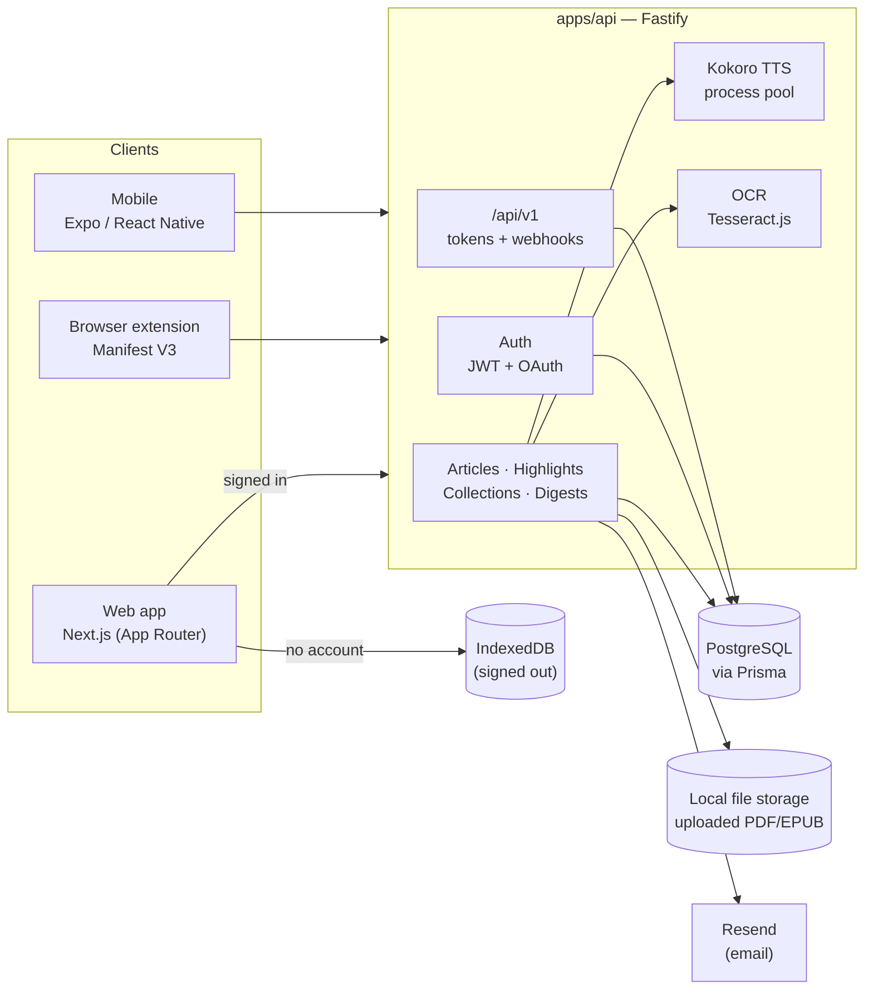

<div align="center">
  
</div>

<div align="center">

[](https://github.com/jguapp/Booklet/actions/workflows/ci.yml)


</div>

## Why this exists

Read-it-later apps have a well-known failure mode: articles pile up in a
queue nobody ever clears, and highlights — the actual reason most of them
got saved in the first place — vanish into a list that's never reopened
again. Booklet is built around fixing that second half specifically. A
highlight isn't a stored string; it's a flashcard whether you meant it to
be one or not, and it resurfaces later on a real spaced-repetition
schedule (SM-2, the same algorithm behind Anki) instead of sitting inert.

Everything else follows from a handful of opinions taken further than most
projects in this space bother to:

- **Offline is the default, not a fallback.** Saving, reading,
  highlighting, resurfacing, PDF/EPUB rendering, search, OCR, and
  text-to-speech all work with zero account, backed by IndexedDB in the
  browser. An account exists for exactly one reason — syncing a library
  across devices — and nothing product-facing is gated behind creating one.
- **A saved PDF or EPUB is rendered, not flattened.** Pages render via
  `pdfjs-dist` (real canvas output plus a precisely positioned, selectable
  text layer); EPUB chapters render via `epub.js` (real pagination, real
  iframe rendering). Highlights anchor to page coordinates or an EPUB CFI
  range — not a character offset into a lossy text extraction that drifts
  the moment formatting changes.
- **Read-aloud is engineered to feel instant, not just work.** Kokoro (an
  open-weight, 82M-parameter TTS model) runs through a small pool of real
  worker processes on the server, over ONNX Runtime's native execution
  path — measured concurrent generation fast enough that the gap between
  one sentence ending and the next starting is 1-2 milliseconds, not the
  multi-second pause most from-scratch TTS integrations settle for. See
  [Architecture](#architecture) for why that took a process pool instead
  of the more obvious approach.
- **The integration surface is a first-class product, not an
  afterthought.** A versioned `/api/v1`, personal access tokens, and
  HMAC-signed webhooks ship alongside the app itself — kept deliberately
  decoupled from the internal routes so a frontend refactor can't quietly
  break someone's script.

No account is required to use any of this — saves and highlights live in
the browser (IndexedDB) by default, and signing in for the first time
migrates whatever's already saved locally onto the account rather than
leaving it behind.

**This is proprietary software.** Booklet is not open source. No license is
granted for use, modification, or redistribution of any part of this
repository — see [License](#license). The engineering practices below
(real CI, a documented architecture, a public API) are the same ones an
open-source project of this size would carry; the source just isn't
licensed for reuse.

## Architecture

A pnpm monorepo: one Fastify API backing three real clients (a Next.js web
app, a Manifest V3 browser extension, and an Expo/React Native mobile
app), plus a fourth "client" that never touches the network at
all — signed-out mode reads and writes IndexedDB directly in the browser
and only starts talking to the API once an account exists.



A few decisions in that diagram are worth explaining rather than just
drawing:

- **The Kokoro TTS pool is real child processes, not worker threads.**
  `onnxruntime-node`'s native binding was confirmed by hand to crash the
  whole Node process the instant `generate()` runs inside a
  `worker_thread` — loading the model there works fine, generating audio
  doesn't. A pool of independent OS processes sidesteps that entirely
  (each is just another `node` invocation, exactly like the main server
  itself) while still turning "generate one sentence at a time" into
  genuine wall-clock parallelism: three concurrent generations measured
  at roughly the same time as one, not three times as long.
- **The API is stateless enough that the file store is the only thing
  that isn't.** Uploaded PDFs/EPUBs live on local disk today
  (`storage-service.ts`, streamed rather than fully buffered into memory
  on read), behind a narrow enough interface that swapping it for S3 is a
  three-function change, not a rewrite.
- **Signed-out mode isn't a demo mode.** `apps/web/src/lib/local/db.ts`
  and `apps/web/src/lib/data/*.ts` implement the exact same
  save/highlight/resurface contract IndexedDB-side that `apps/api`
  implements Postgres-side — the UI layer calls one repository interface
  and doesn't know or care which backend is answering.

## A few things worth pointing at

Some other choices that aren't just "yet another CRUD app":

- **OCR that runs itself.** A scanned PDF with no usable text layer gets
  fed through [Tesseract.js](https://github.com/naptha/tesseract.js)
  automatically on upload — no toggle, no "try OCR" button, no API key.
- **A real open-source TTS model — and a real playback experience around
  it.** [Kokoro](https://huggingface.co/onnx-community/Kokoro-82M-v1.0-ONNX)
  (82M params, Apache-2.0) generates through a small server-side worker
  pool (see [Architecture](#architecture)) fast enough to keep up with
  playback in real time, driving a persistent, Spotify-style "now
  playing" bar that survives navigating away from the article, live
  word-level read-along highlighting, and a Readwise-style section
  indicator tracking which paragraph is currently being read — no API
  key either way, since inference is self-hosted, just server-side now
  instead of in-browser WASM.
- **A public, versioned API.** `/api/v1`, personal access tokens, and
  HMAC-signed webhooks — the same integration surface a much bigger
  product would ship, kept deliberately decoupled from the internal
  routes so a frontend refactor can't silently break someone's script.
- **Everything works signed out.** The entire save → read → highlight →
  resurface loop, PDF/EPUB rendering, search, TTS, and OCR all work with
  zero account, backed by IndexedDB. An account exists for exactly one
  reason — syncing across devices — and nothing is gated behind creating
  one.
- **CI that actually runs the hard parts.** Typecheck/lint, unit,
  integration, two real e2e suites (including a genuine Kokoro model
  download and a headed-Chromium extension load under `xvfb`), and a Docker
  build-and-smoke-test — the whole pipeline, not just the paths someone
  remembered to check. Written twice, for GitHub Actions and GitLab; see
  [Testing](#testing) for which is live.

## Status

The full save → read → highlight → resurface loop works end to end, backed
by a real API and database, with account creation genuinely optional
throughout. Grouped by area rather than one flat list:

<details open>
<summary><strong>Core loop</strong> — data model, auth, saving</summary>

- [x] Core data model — Prisma schema for User, Article, Highlight,
      Annotation, Collection (with smart/filter-based and nested
      collections), ApiToken, Webhook, Session, Feed, Digest, and
      password-reset/email-verification tokens, migrated to a live database
- [x] Auth — sign up / log in / log out, password reset, email verification,
      per-device session management (list + revoke, "log out other
      devices"), and **OAuth (Google + GitHub)** alongside email/password.
      Short-lived JWT access tokens, rotated opaque refresh tokens stored
      hashed server-side. Every provider — email/password included — is
      **entirely optional**: every route works signed out, and OAuth only
      appears in the UI once a provider's credentials are configured
- [x] Save article by URL — server-side fetch + Readability extraction, with
      SSRF hardening (blocks private/loopback/link-local targets on every
      redirect hop) and canonical-URL duplicate detection (catches a
      tracking-param or AMP-link variant of something already saved).
      Remote images are fetched server-side and inlined as base64 `data:`
      URIs, so a saved article's images survive even after the source page
      disappears
- [x] Save PDF/EPUB — server-side extraction via the same stateless endpoint
      either way, signed in or not. Real rendering, not extracted text: PDF
      pages render via pdfjs-dist (canvas + a precisely-positioned text
      layer for selection), EPUB chapters render via epub.js (paginated,
      real iframe rendering). Highlights anchor by page+rects (PDF) or CFI
      range (EPUB)
- [x] OCR fallback — a scanned PDF with an empty/near-empty native text
      layer automatically falls back to Tesseract.js recognition (capped at
      20 pages, since it runs synchronously in the upload request), with a
      visible "may contain recognition errors" notice in the reader
- [x] Local ↔ account sync — creating an account migrates existing local
      articles, highlights, and collections onto it instead of stranding them

</details>

<details open>
<summary><strong>Reading & annotation</strong></summary>

- [x] Reader view — light/dark/sepia/Kindle theming, adjustable type size,
      select-to-highlight with optional notes, drift-tolerant highlight
      re-anchoring
- [x] Highlight notes — shown as a small click-to-open icon next to the
      highlight (Apple Books style), never the note text itself sitting in
      the reading flow
- [x] Dictionary lookup — select any word in an article, PDF, or EPUB and
      look it up inline (Apple Books-style popover), no separate tab
- [x] Text-to-speech, two engines — the browser's native Web Speech API
      (zero setup, the default), or **Kokoro**, an open-source 82M-param
      model generated through a server-side worker-process pool (real
      `onnxruntime-node` native execution, not a WASM sandbox — measured
      2.5-3.8x faster) so playback keeps up with generation in real time.
      Drives a persistent, Spotify-style player bar that survives
      navigating away from the article, live word-level read-along
      highlighting (estimated from playback position, since the model
      emits no per-word timestamps), and a Readwise-style left-border
      indicator for the current paragraph. No API key either way — the
      model is self-hosted, just server-side now instead of in-browser WASM
- [x] Reading progress — a visual progress bar for every reader (article,
      PDF, EPUB), plus periodic + visibility-triggered persistence (not just
      on navigate-away — a hard reload or tab close can interrupt an
      in-flight async write before that would fire) so the last-visited
      scroll position (HTML), page (PDF), or chapter (EPUB, via epub.js's
      own location index) is restored on next open
- [x] Resurfacing — real SM-2 spaced repetition (interval growth on recall,
      reset on a miss), not a heuristic. Digest generation persists and
      reuses a batch per the user's DAILY/WEEKLY frequency instead of
      re-rolling one on every visit; feedback ("remembered" / "forgot" /
      archive) updates the schedule. Digest emailing sends for real via
      Resend when configured, logs to the console otherwise
- [x] Recall prompts — a highlight can carry a question whose answer is the
      highlight. Daily Review asks it first and keeps the passage, the note,
      *and* the grade buttons hidden until you ask for them, because
      recognition feels like recall but isn't — showing the answer first meant
      SM-2 was grading re-reads rather than the retrieval attempts it was
      designed for. Additive: a highlight without a prompt renders and grades
      exactly as before, on web and on mobile

</details>

<details open>
<summary><strong>Library, organization & search</strong></summary>

- [x] Reading list / library view — IndexedDB-backed when signed out, synced
      via the API when signed in, same UI either way. Defaults to the
      Unread tab (what's actually waiting to be read). Delete, archive,
      favorite, organize into collections, and tag (free-form,
      lighter-weight than collections) in both modes
- [x] Nested and smart collections — fold a collection under another, or
      define one by a filter (status/tags/text query) so membership is
      computed live rather than a fixed list
- [x] Command palette — Cmd/Ctrl+K to jump to any page, collection, or
      article, or fall through to a live search
- [x] Full-text search — title/excerpt/author/site/body-text/tags for
      articles, selected text/notes for highlights. Plain case-insensitive
      matching rather than Postgres tsvector, on purpose: local/anonymous
      mode has no full-text index at all, so both modes behave the same way
      instead of signed-in users getting relevance-ranked results local mode
      structurally can't match
- [x] "More from your library" — related-article suggestions once you're
      most of the way through something, scored by tag/title-keyword/site/
      author overlap (no embeddings infrastructure exists yet — see
      [Roadmap](#roadmap))
- [x] Stats & Recap — an activity heatmap, streaks, completion rate, and
      time spent, plus a weekly/monthly "wrapped"-style summary

</details>

<details open>
<summary><strong>Cross-app sync & automation</strong></summary>

- [x] Import — Pocket/Instapaper CSV, browser bookmarks, and a real Kindle
      "My Clippings.txt" export (one article per book, every highlight and
      note attached)
- [x] Export — Markdown (for Obsidian/Notion/Logseq) and Anki flashcards
- [x] Send to Kindle — emails a generated HTML file to your own
      `@kindle.com` address, the same mechanism Amazon's own "send to
      Kindle" feature uses
- [x] A public, versioned API (`/api/v1`) — articles, highlights, and
      collections, kept deliberately separate from the internal routes
- [x] Personal access tokens — read or read+write scoped, shown once at
      creation
- [x] Webhooks — HMAC-SHA256-signed deliveries on `article.created` /
      `highlight.created`, with a visible delivery-history log
- [x] RSS — subscribe to a feed, see its items, save any of them into the
      library
- [x] Podcast feed — your reading queue (unread + in-progress, not the whole
      back catalogue) as a real RSS feed, one audio file per article, so
      read-aloud reaches the lock screen, CarPlay, playback speed and offline
      sync that podcast clients already solved. The feed token is
      `bkpod_`-prefixed and cannot become a session anywhere in the app, and
      `POST /api/tokens` refuses to mint the scope, so the boundary is the
      token's *format* rather than a per-route check somebody has to remember.
      Playback position deliberately does not sync back — no podcast client
      has a field for reporting it
- [x] Public sharing — an unlisted page for one article's highlights or one
      collection's. Excerpts only (the reader's own selected text, never the
      publisher's), revocation deletes the row rather than flipping a boolean
      so a leaked URL cannot be un-revoked, and smart collections are refused
      because their membership is a live query — sharing one would publish
      articles saved after the link went out
- [x] Onboarding seeds — a new, empty account has something to read on day
      one: passages highlighted by at least three accounts that separately
      opted in, plus 19 hand-transcribed public-domain passages for when the
      aggregate is empty. Opt-in and separate from sharing itself, and the
      three-account threshold is enforced at write time, since a read-side
      filter leaves one-person rows in the table

</details>

<details open>
<summary><strong>Platform, testing & ops</strong></summary>

- [x] Browser extension (`apps/extension`) — log in, save the current page
      from the toolbar or a right-click menu. Real icon set, Firefox
      support (one manifest, both browsers) — see `apps/extension/README.md`
- [x] Mobile app (`apps/mobile`) — Expo/React Native, and actually running
      (web target, verified via Playwright against the real dev API — no
      simulator/device in this environment, see that app's README for
      exactly what is and isn't covered). Local-first like the web app
      (AsyncStorage instead of IndexedDB, same repository-pattern swap
      point), with highlighting (a toggled select-then-highlight flow --
      React Native has no single component that both reports a text
      selection and renders per-range styling, unlike a browser),
      collections, PDF/EPUB upload (as extracted text — no real page/CFI
      rendering, which needs DOM canvas/iframe APIs React Native doesn't
      have), and Daily Review/resurfacing with the same SM-2 feedback loop
- [x] API rate limiting — a global per-IP ceiling plus tighter per-route
      budgets for TTS generation, the credential-guessing auth routes, and the
      public share pages, and a per-*account* failed-login backoff that
      escalates a wait instead of locking anyone out. Error monitoring
      (Sentry, no-op without a DSN) — see `DEPLOYMENT.md` for every knob
- [x] Automated tests — unit (SM-2, highlight anchoring, URL canonicalization,
      collection filters, recap math, Kindle-clippings parsing, TTS chunking,
      read-along timing, recall prompts, plus a Vitest + jsdom runner for the
      web app's own DOM logic and React components), integration
      (the full API surface via Fastify's `.inject()`), and e2e (Playwright:
      the local/anonymous IndexedDB path, real PDF/EPUB rendering and
      highlighting, dictionary lookup, both TTS engines — including a real
      Kokoro model download and generation, not mocked — OAuth, and the
      browser extension loaded for real in Chromium). `pnpm verify` runs
      everything this machine can check and names what it skipped — see
      [Testing](#testing)
- [x] CI — the full suite (typecheck/lint, unit, integration, both e2e
      suites, a TTFA benchmark, and a Docker build-and-smoke-test) as seven
      jobs, written twice: for GitHub Actions and for GitLab. Read
      [Testing](#testing) before relying on either — the Actions allowance is
      exhausted and the GitLab port has not run yet
- [x] Deployment configs — Dockerfiles for both apps and `docker-compose.yml`,
      build-verified by CI's `docker-build` job (a real image build plus an
      API smoke test against a real Postgres) — see `DEPLOYMENT.md` and
      [Roadmap](#roadmap) for what's still needed to put them on a real host

</details>

## Testing

```bash
pnpm verify                             # everything checkable without a running service, and it names what it skipped
pnpm verify --e2e                       # also the browser suite (needs dev servers up; it prints the setup)
```

`pnpm verify` exists because "the tests pass" was quietly ambiguous: `pnpm
test` runs the three unit suites and nothing else — not lint, not typecheck,
not the production esbuild bundle, which has broken while every other signal
stayed green. It closes with what it *cannot* cover anywhere (`docker-build`
above all), because a verification tool that silently skips things teaches you
to read a green summary as "safe to deploy". The individual suites:

```bash
pnpm --filter @booklet/shared test      # 115 unit tests: SM-2, highlight anchoring, URL canonicalization,
                                        #   collection filters, recap, Kindle clippings, TTS chunking,
                                        #   read-along timing, recall prompts, reading stats, related articles
pnpm --filter @booklet/web test         # 40 unit tests (Vitest + jsdom): DOM-range bridging, React components
pnpm --filter @booklet/api test         # 250 integration tests: full API via Fastify .inject(), real dev DB
pnpm --filter @booklet/web test:e2e     # e2e: 122 Playwright tests across 48 spec files — local/anonymous
                                        #   flow, real PDF + EPUB rendering, dictionary, TTS, recall prompts
pnpm --filter @booklet/extension test:e2e   # e2e: loads the real built extension in Chromium (headed -- see its README)
```

The web unit runner (#165) is newer than the rest: until it existed, ~19,000
lines of the app's own logic had no runner at all, and three real bugs shipped
that a sub-second test here would have caught — both chunk-0 sizing bugs in
the TTS chunker, the read-along section anchor resolving to the wrong element
at a text-node boundary, and the highlight popover dismissing itself on a
scroll event that arrived after it opened. Every one surfaced as a slow,
intermittent e2e failure that read like flakiness. Rendering React there needs
a 40-line local helper rather than `@testing-library/react`; see
`apps/web/vitest.config.ts` for why (three React copies, and a resolution
order Vite never gets to influence).

`apps/web/e2e` covers the local/anonymous save→read→highlight loop, the
real PDF (`pdf-reader.spec.ts`) and EPUB (`epub-reader.spec.ts`) readers
end to end (actual canvas rendering and iframe-based pagination in a real
browser, not mocked), dictionary lookup, native text-to-speech (skipped
automatically in environments with no system TTS voice, such as headless
CI), **Kokoro text-to-speech (`tts-player.spec.ts`) — real server-side
generation and playback, not mocked, covering the persistent player bar,
read-along highlighting, and a regression guard against a chunking bug
that once turned one Wikipedia article into 2,283 separate TTS
requests**, Kindle import/export
(`kindle-sync.spec.ts`), recall prompts (`recall-prompts.spec.ts`), the
command palette, smart/nested collections, duplicate detection, related
articles, and tags/search/reading-progress persistence
(`tags-search-progress.spec.ts`). `apps/mobile` has no automated test suite
(`tsc --noEmit` only); its web target was verified manually the same way, see
`apps/mobile/README.md`.

### CI

Two equivalent pipelines exist, and **it is not safe to assume either is
running on your pushes right now**:

- [`.github/workflows/ci.yml`](.github/workflows/ci.yml) — seven jobs:
  typecheck/lint for every package, the shared/web unit suites, the API suite
  and both e2e suites against a real Postgres service container, the
  extension's under `xvfb`, a Kokoro TTFA benchmark, and a `docker-build` job
  that builds both production images and smoke-tests the API image. Its runs
  have gone green on real hardware — but this repository's Actions allowance
  is exhausted, so it is dormant.
- [`.gitlab-ci.yml`](.gitlab-ci.yml) — the same seven jobs, ported rather than
  copied (service hostnames, service readiness, and Docker-in-Docker
  networking all genuinely differ). It has never executed, because the
  repository is on GitHub. See [`docs/CI_GITLAB.md`](docs/CI_GITLAB.md) for
  what changed, the project settings the file cannot set itself, and the
  runner-minutes analysis worth reading before switching — GitLab.com's free
  tier is *smaller* than Actions'.

Until one of them is genuinely live, `pnpm verify` above is the stand-in.
`DEPLOYMENT.md`'s "Which CI config is live" has the full picture, including
why neither file should be deleted.

## Roadmap

What's left is almost entirely things this environment genuinely cannot do
(no Apple/Google/Mozilla developer account, no cloud hosting account, no
device/simulator) rather than unstarted work. See the
[open issues](https://github.com/jguapp/Booklet/issues) for the current
breakdown, one issue per item below:

- **Mobile app on a real device/simulator** — the web target runs and is
  verified; `ios`/`android` are type-checked only, since this environment
  has no Xcode/iOS Simulator or Android Studio/emulator. Eventually a real
  App Store / Play Store release, which needs developer accounts that
  don't exist here either
- **Browser extension store publishing** — Chrome Web Store and
  addons.mozilla.org both need developer accounts this environment doesn't
  have. Safari support needs Xcode's `safari-web-extension-converter`
  (macOS-only)
- **Real production hosting** — the Dockerfiles and `docker-compose.yml`
  are build-verified in CI (image build + API smoke test against Postgres),
  but nothing is deployed to an actual host yet. Needs a hosting decision
  (Fly.io / Railway / a VPS / etc.), a managed Postgres instance, and real
  `RESEND_API_KEY` / `SENTRY_DSN` / OAuth production credentials
- **Production OAuth app registration** — Google/GitHub OAuth work today
  against locally-registered dev credentials; production needs its own
  registered redirect URIs once a real domain exists
- **Translation** and **a higher-tier self-hosted TTS model (Chatterbox)**
  are scoped in their own closed-but-documented issues — both need a real
  external resource this environment doesn't have (a paid translation API
  key; a hosting/cost decision for a self-hosted ML inference service,
  respectively) rather than more engineering time
- Smaller, not-yet-started polish: React Navigation for mobile once it has
  more than a handful of screens; real page/CFI rendering for mobile
  PDF/EPUB (needs a WebView bridge to reuse the web app's pdfjs-dist/
  epub.js code, or a native renderer — a real project of its own, not a
  scaffold-stage add-on); prompt authoring on mobile, which honors a recall
  prompt written on the web but cannot yet write one

See each app's own README (`apps/mobile`, `apps/extension`) for exactly
what's verified and what isn't within these constraints.

## Tech stack

| Layer | Choice |
| --- | --- |
| Monorepo | pnpm workspaces |
| API | Node.js, TypeScript, Fastify |
| Database | PostgreSQL via Prisma ORM (v7, driver adapters) |
| Web app | Next.js (App Router), TypeScript, Tailwind CSS v4 |
| Browser extension | Manifest V3, esbuild, no framework |
| Mobile | Expo / React Native |
| Article extraction | Mozilla Readability + jsdom (HTML), pdfjs-dist (PDF), jszip + jsdom (EPUB) |
| PDF/EPUB rendering | pdfjs-dist (canvas + text layer) and epub.js (paginated, CFI-anchored) in the browser -- real page/chapter rendering, not extracted text |
| OCR | Tesseract.js -- in-process WASM, no external API, triggered only when a PDF's native text layer is empty/sparse |
| Text-to-speech | Browser SpeechSynthesis (default) or Kokoro via kokoro-js -- an 82M-param open-weight model, generated server-side through a pool of worker processes over ONNX Runtime's native execution path (`onnxruntime-node`), not in-browser WASM |
| Auth | Email/password + OAuth (Google, GitHub), JWT access + refresh tokens; every method is optional — only needed for sync |
| Local storage | IndexedDB (no-account mode is the default, not a fallback) |
| Email | Resend, with a console-log fallback when unconfigured |
| Error monitoring | Sentry (`@sentry/node` / `@sentry/browser`), no-op without a DSN |
| Testing | Vitest (unit + integration), Playwright (e2e) |
| Fonts | Literata (serif, reading) + Work Sans (sans, UI chrome) |

## Project structure

```
apps/
  api/            Fastify API + Prisma schema
  web/            Next.js web app
  extension/      Browser extension (Manifest V3)
  mobile/         Expo/React Native app
packages/
  shared/         Types and logic shared across apps
                  (request/response DTOs, highlight anchoring, SM-2 resurfacing)
docker-compose.yml, apps/*/Dockerfile, DEPLOYMENT.md
                  Deployment configs (see DEPLOYMENT.md for verification status)
.github/workflows/ci.yml, .gitlab-ci.yml
                  CI: typecheck/lint, unit + integration + e2e tests, Docker build.
                  Two equivalent pipelines -- see DEPLOYMENT.md for which is live
scripts/verify.mjs
                  `pnpm verify`: everything this machine can check, and what it can't
```

## Getting started

Requires Node 22.13+ (pnpm 11's own minimum) and pnpm. You also need a
PostgreSQL database -- either a real one, or the bundled dev database (no
install required, see below).

```bash
pnpm install

cp apps/api/.env.example apps/api/.env        # fill in DATABASE_URL, JWT_ACCESS_SECRET, etc.
cp apps/web/.env.example apps/web/.env.local

pnpm dev:db    # local Postgres-compatible dev database (skip if using real Postgres)
pnpm dev:api   # Fastify API on :4000
pnpm dev:web   # Next.js app on :3000 (or the next free port)
```

The Prisma client regenerates automatically on install.

**Using a real Postgres:** point `DATABASE_URL` at it and run
`pnpm --filter @booklet/api exec prisma migrate deploy` (or `migrate dev`
while iterating on the schema).

**Using the bundled dev database:** `pnpm dev:db` starts a small
[PGlite](https://pglite.dev)-backed server that speaks the Postgres wire
protocol on `localhost:5432` and persists to `apps/api/.pglite-data/` --
useful for local development without installing Postgres or Docker. Prisma's
own migration engine doesn't talk to it reliably, so apply schema changes
with `pnpm --filter @booklet/api migrate:pglite` instead of `migrate dev`/
`migrate deploy` when using this database.

**Browser extension:** `pnpm --filter @booklet/extension build`, then load
`apps/extension/dist` as an unpacked extension in Chrome or Firefox. See
`apps/extension/README.md`.

**Mobile app:** `pnpm --filter @booklet/mobile web` (or `ios` / `android`
with the respective toolchain installed). The web target is verified end
to end; see `apps/mobile/README.md` for exactly what is and isn't.

**Deploying:** see `DEPLOYMENT.md`.

## License

Copyright © 2026 jguapp. All rights reserved.

This repository and its contents are proprietary and confidential. No part of
this codebase may be copied, modified, merged, published, distributed,
sublicensed, or used for any purpose without prior written permission from
the copyright holder.
