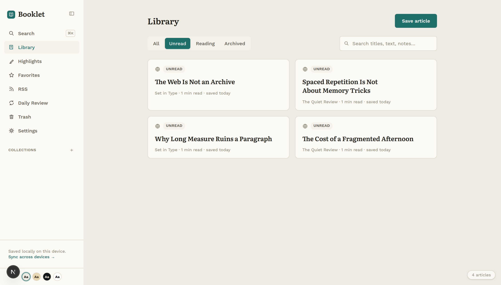
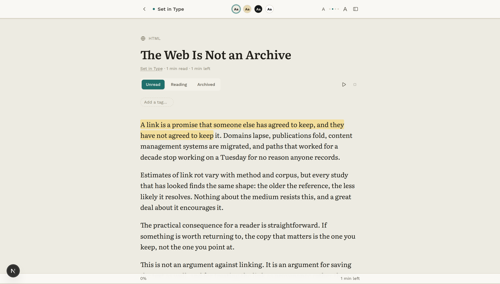
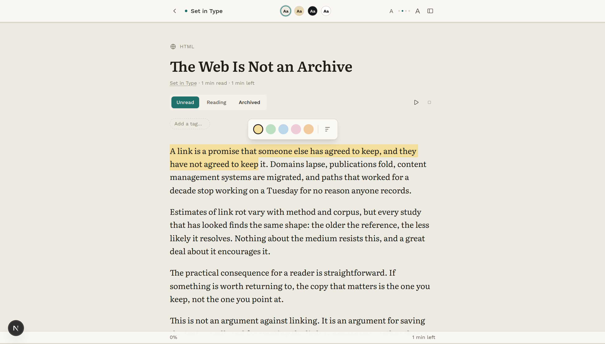
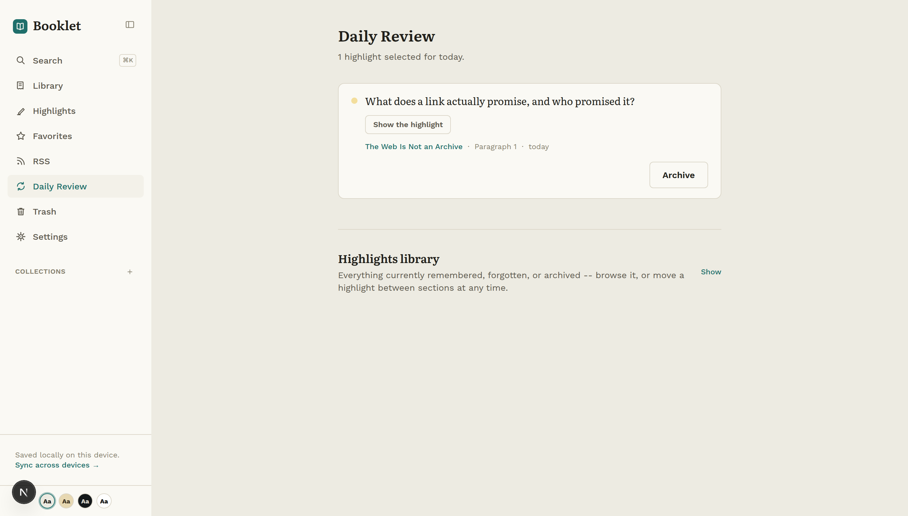
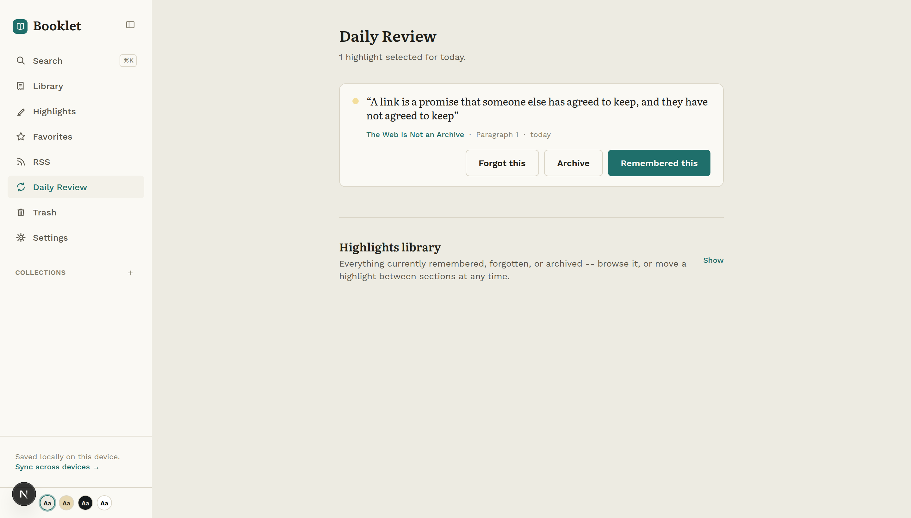
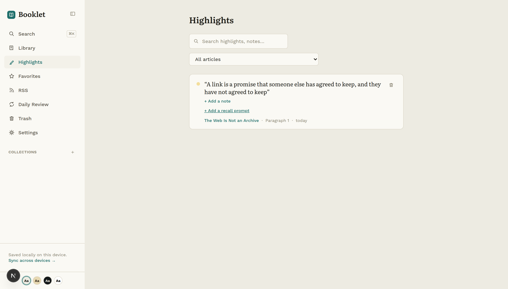
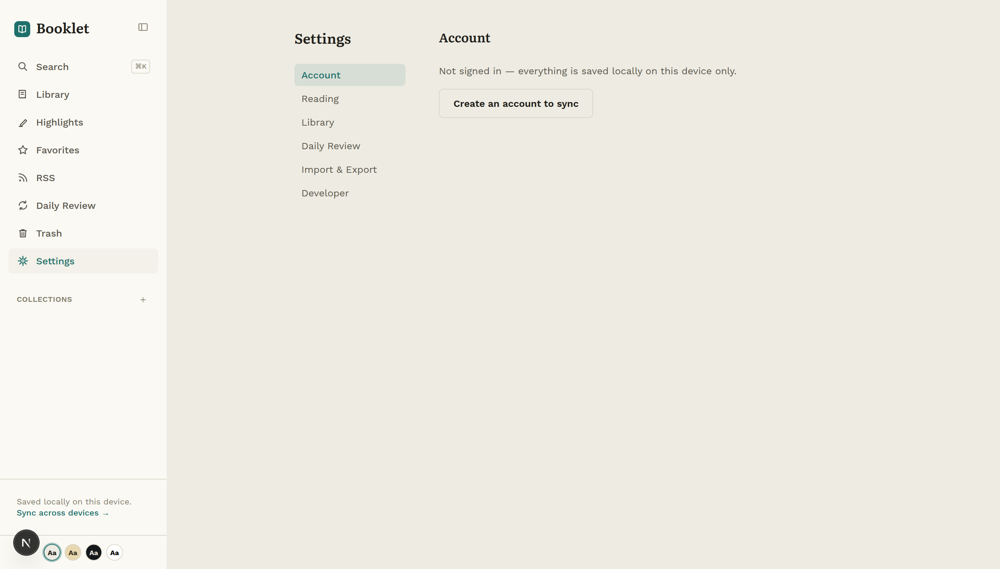

<div align="center">
  
</div>

<div align="center">

# Booklet

**A read-later app that assumes you actually want to remember what you read.**

Save anything. Read it beautifully. Highlight what matters —
then get asked about it later, *before* you're shown the answer.

</div>

<div align="center">


</div>

<div align="center">
  
</div>

---

## What it is

Booklet saves articles, PDFs, and EPUBs, strips away everything that isn't the
text, and then gives you the tools to actually read them — offline, read aloud,
searchable by meaning, highlighted, and brought back before you forget.

It works **completely without an account**. Your library lives in your browser
and stays there. Signing in adds a synced copy; it doesn't unlock the product.

---

## The problem

Every read-later app has the same failure mode. Articles pile into a queue
nobody clears, and highlights — the actual reason most things get saved —
disappear into a list that never gets reopened.

The usual answer is a "resurfacing" feature that shows you an old highlight and
asks whether you remembered it. **That ordering is backwards.** You're being
asked to grade a recall attempt you were never given the chance to make, and
recognition feels like recall without being it.

Booklet fixes the second half of the problem specifically.

---

## Features

### Reading that gets out of the way

Article extraction keeps the text and throws away the furniture. The result
renders in a typographic frame built for long-form: four themes, adjustable
measure and size, and progress that survives a reload.

Images are inlined at save time, so an article you saved still works after the
original goes offline or moves behind a paywall.

<div align="center">
  
</div>

### Highlights that anchor, and survive

Select text and it stays selected — through a re-extraction, a re-save, or an
article that quietly changed underneath you. Highlights store enough
surrounding context to find themselves again rather than a fragile character
offset.

Five colors, margin notes, and a notebook panel that collects every highlight
in one place.

<div align="center">
  
</div>

### Review that is actually retrieval practice

This is the part Booklet is built around.

A daily review shows you a **prompt first** — the highlight with its key idea
withheld — and asks you to recall it. Only then does it reveal the passage and
ask how you did. Scheduling is SM-2, the same spaced-repetition algorithm
behind most flashcard software, so items you know drift further apart and items
you don't come back sooner.

<div align="center">
  
</div>

<div align="center">
  
</div>

### Search that understands what you meant

Two engines, fused. Ranked full-text search handles the exact things — a name,
a phrase, a title. Semantic search handles the rest.

Searching *"why deadlines make people creative"* finds an essay about working
under constraint **that never uses any of those words** — measured at `0.44`
similarity against `-0.02` for unrelated text. Both run locally: Postgres
full-text on the server, a MiniLM embedding model in a Web Worker in your
browser.

<div align="center">
  
</div>

### Listen to anything, with no API bill

Neural text-to-speech runs on your own hardware — Kokoro-82M on CPU, no
per-character billing, no third party receiving your library. Word-level
read-along highlighting tracks the voice, playback position syncs across
devices, and a private podcast feed lets you listen to your queue in any
podcast app.

### Works signed out, forever

The library lives in IndexedDB. No account, no network, no server that can
disappear and take your reading with it. Sign in and you get a synced copy —
the same features, on more devices.

That rule is enforced, not aspirational: full-text search was *rejected* until
the browser had a real ranked index of its own, and semantic search shipped
server-side and browser-side before it counted as done.

<div align="center">
  
</div>

### And the rest

| | |
|---|---|
| **Capture** | Browser extension (Chrome + Firefox), URL, file upload, RSS |
| **Formats** | HTML, PDF with a real text layer, EPUB, OCR fallback for scans |
| **Organize** | Nested collections, smart filters, tags, favorites, trash with 30-day retention |
| **Insight** | Reading stats, streaks, a periodic recap, email digests |
| **Share** | Public links for an article or a single highlight |
| **Integrate** | Versioned public API, personal access tokens, outbound webhooks |
| **Import** | Kindle `My Clippings.txt`, full export and re-import |

---

## How it works

```
  Extension · URL · Upload · RSS
                │
                ▼
     Extraction  ──  Readability · PDF · EPUB · OCR
                │     sanitized, images inlined
                ▼
        Article record
                │
        ┌───────┴────────┐
        ▼                ▼
   IndexedDB         PostgreSQL         ← local first, server optional
   (your device)     (if signed in)
        └───────┬────────┘
                ▼
   Reader · Search · TTS · Highlights · Review · Podcast
```

**The seam that matters** is `apps/web/src/lib/data/*`. Every module there
exposes one function that branches on whether you are signed in — IndexedDB on
one side, the API on the other, the same shape returned either way. Nothing
above that layer knows or cares which mode it is in.

A few decisions worth calling out:

- **Speech is chunked for latency, not tidiness.** The first chunk is capped at
  80 characters against 140 for the rest, because it is the one you are waiting
  on. Generation runs ahead of playback so you never hear the seam.
- **Search snippets never contain HTML.** Postgres `ts_headline` does not
  escape the document it quotes, so match markers are control characters the
  client converts *after* escaping. Asking it for `<mark>` would pipe any saved
  page straight into the DOM.
- **Local writes wait for the transaction, not the request.** IndexedDB reports
  success before the data is durable; awaiting the wrong one loses writes to a
  navigation.

---

## Tech stack

| Layer | Choice | Why |
|---|---|---|
| Language | TypeScript, strict, everywhere | One vocabulary across API, web, mobile, extension |
| API | Fastify 5 | Fast, schema-first, good plugin story |
| Database | PostgreSQL + Prisma 7 | Typed queries, real migrations |
| Web | Next.js 16 (App Router) + React 19 | Server components where they help |
| Styling | Tailwind v4 | Utility-first, no CSS-in-JS runtime |
| Local storage | IndexedDB | Transactional, structured, actually offline |
| Search | Postgres `tsvector` + MiniSearch + MiniLM | Exact and semantic, fused with RRF |
| TTS | Kokoro-82M via onnxruntime | 82M params, runs on CPU, no API bill |
| Extraction | `@mozilla/readability` + jsdom | The same engine Firefox Reader View uses |
| PDF / EPUB | pdf.js · epub.js · Tesseract.js | Real rendering, real OCR fallback |
| Mobile | Expo + React Native | Shares the same typed core |
| Testing | Vitest + Playwright | Fast unit, real browser e2e |
| Monorepo | pnpm workspaces + Turborepo | Caching, filtered runs |

---

## Status

**Feature-complete and not yet deployed.** Everything above works and is
tested. What remains is a front-end visual redesign and the deployment itself.

| | |
|---|---|
| **Source** | 287 TypeScript files across 4 apps + 1 shared package |
| **Data model** | 20 Prisma models, 24 migrations |
| **Tests** | 70 unit files (Vitest) · 51 Playwright e2e specs |
| **One command** | `pnpm verify` runs 11 checks and tells you what it *didn't* |

This repo documents its own mistakes on purpose — in commit messages and in
comments that explain not just how something works but what was tried,
rejected, and reversed, including the bugs that shipped and how they were
found.

**Known and written down:** the Docker volume behaviour needs one real
`docker compose` run to verify, the podcast feed has never been subscribed to
in a real podcast client, and it needs cover art before Apple would accept it.
Each is tracked with the exact command or asset that closes it.

---

## Getting started

```bash
# 1. Install
pnpm install

# 2. Database
docker run -d --name booklet-db \
  -e POSTGRES_USER=postgres -e POSTGRES_PASSWORD=postgres -e POSTGRES_DB=booklet \
  -p 5432:5432 postgres:16

cp apps/api/.env.example apps/api/.env     # set JWT_ACCESS_SECRET
pnpm --filter @booklet/api exec prisma migrate deploy

# 3. Run
pnpm dev:api     # http://localhost:4000
pnpm dev:web     # http://localhost:3000
```

Open `http://localhost:3000` and save something. **No account required.**

```bash
pnpm verify                             # everything checkable on this machine
pnpm test                               # unit suites
pnpm --filter @booklet/web test:e2e     # browser suite (needs both servers)
```

**Extension:** `pnpm --filter @booklet/extension build`, then load
`apps/extension/dist` as an unpacked extension.

**Mobile:** `pnpm --filter @booklet/mobile web` (or `ios` / `android`).

**Deploying:** see `DEPLOYMENT.md`.

---

## Project structure

```
apps/
  api/         Fastify · Prisma · extraction · TTS pool · OCR
  web/         Next.js app — reader, highlights, review, sharing
  mobile/      React Native (Expo)
  extension/   Chrome + Firefox, MV3
packages/
  shared/      Types, SM-2, chunking, anchoring — the shared vocabulary
```

---

## License

Copyright © 2026 jguapp. All rights reserved.

The source is published here to be read. It is **not** licensed for reuse: no
part of this codebase may be copied, modified, distributed, sublicensed, or
used in another project without prior written permission from the copyright
holder.
