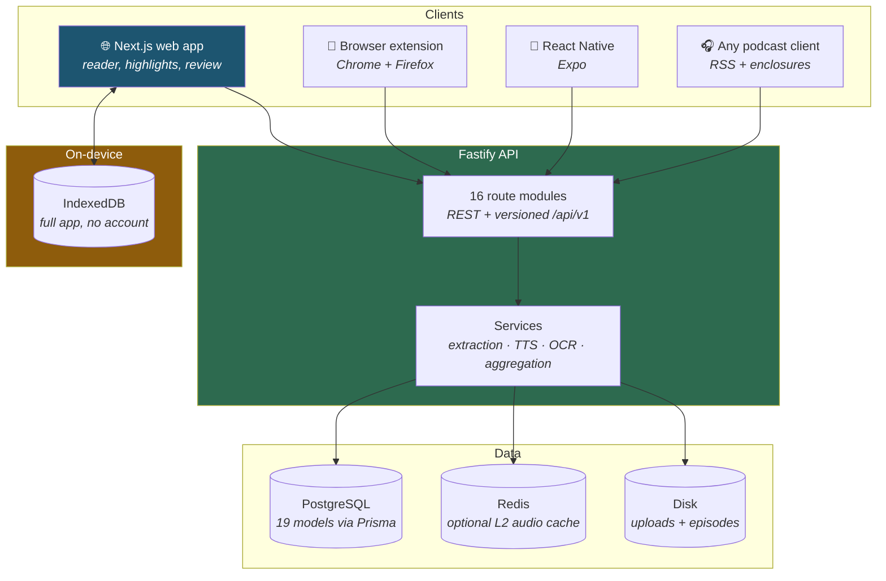
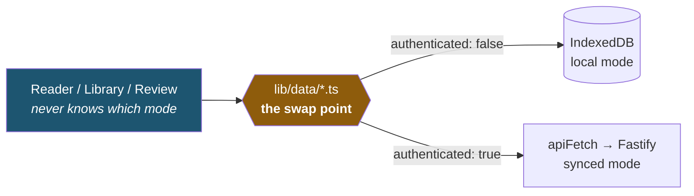
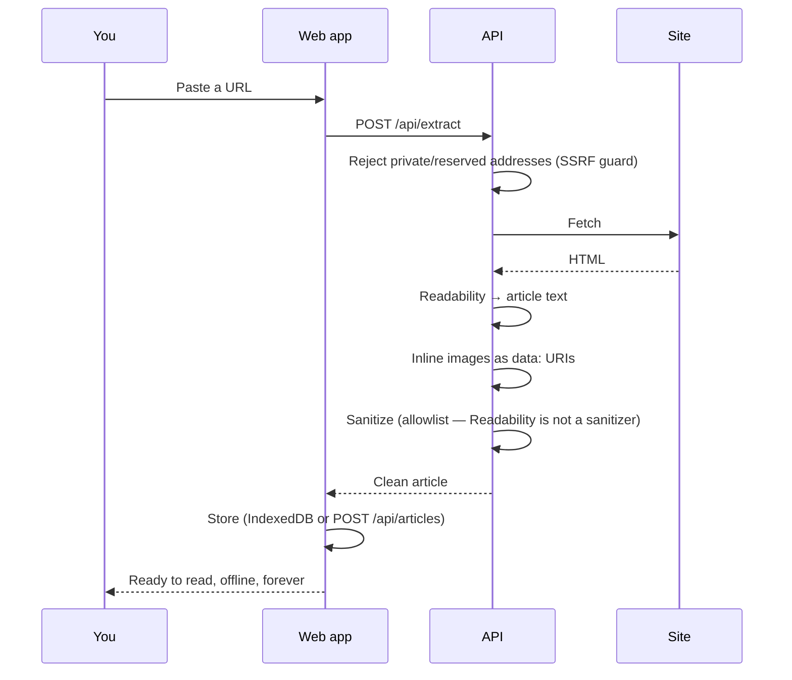
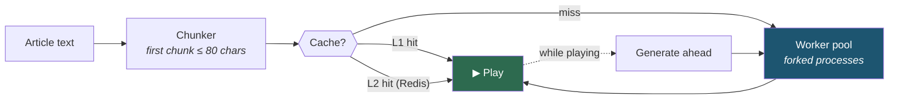

<div align="center">
  
</div>

<div align="center">

**A read-later app that assumes you actually want to remember what you read.**

Save anything. Read it beautifully. Highlight what matters — then get asked
about it later, before you're shown the answer.

</div>

<div align="center">


</div>

---

<div align="center">
  
</div>

---

## The problem

Every read-later app has the same failure mode. Articles pile into a queue
nobody clears, and highlights — the actual reason most things get saved —
disappear into a list that never gets reopened.

The usual answer is a "resurfacing" feature that shows you an old highlight
and asks whether you remembered it. **That ordering is backwards.** You're
being asked to grade a recall attempt you were never given the chance to
make, and recognition feels like recall without being it.

Booklet fixes the second half of the problem specifically.

## What makes it different

### Reading that gets out of the way

Article extraction that keeps the text and throws away the furniture, in a
typographic frame designed for long-form. Four reading themes, adjustable
measure and size, and progress that survives a reload.

<div align="center">
  
</div>

**PDF and EPUB are first-class**, not an afterthought — real page rendering
and real CFI-anchored highlights, not a text dump. Scanned PDFs go through
OCR automatically when there's no text layer to read.

### Highlights that anchor, and survive

Highlights are stored as **W3C-style text-quote and text-position
selectors**, so they re-anchor even when the underlying article changes
slightly. Each one knows where it came from — "p. 42" for a PDF, "Section 4"
for an EPUB, "Paragraph 7" for an article.

<div align="center">
  
</div>

### Review that's actually retrieval practice

Real **SM-2 spaced repetition** — the SuperMemo algorithm, not an
approximation of it. Every highlight carries its own easiness factor,
interval, and next-due date.

And the part that matters: a highlight can carry a **recall prompt**. When it
does, Daily Review asks the question and withholds *both the passage and the
grade buttons* until you've actually tried to answer.

<table>
<tr>
<td width="50%"></td>
<td width="50%"></td>
</tr>
<tr>
<td align="center"><b>With a prompt</b> — question first, answer on demand</td>
<td align="center"><b>Without one</b> — unchanged, so nothing breaks</td>
</tr>
</table>

### Listen to anything, with no API bill

Local neural text-to-speech via **Kokoro-82M**, running on your own CPU. 54
voices, word-level read-along highlighting, and a two-tier cache so a
re-listen is instant.

It also publishes your queue as a **private podcast feed**, so your reading
list shows up in whatever player already has your lock-screen controls,
CarPlay, and sleep timer.

### Works signed out, forever

The whole app runs against IndexedDB with no account at all. Accounts exist
**only** for sync — and when you make one, your local library migrates up
in batches, resumable, with every field carried across.

<div align="center">
  
</div>

### And the rest

**Share** a collection's highlights on a public, unlisted page that reveals
nothing else about your account · **Search** across titles, text and notes ·
**Collections**, nested and smart · **RSS** subscriptions · **Import** from
Pocket, Instapaper, browser bookmarks and Kindle `My Clippings.txt` ·
**Export** to Markdown for Obsidian · a **browser extension** for Chrome and
Firefox · a **public API** with personal access tokens and webhooks · and a
**React Native** app.

---

## Architecture

Four clients, one API, one shared vocabulary package.



### The offline-first seam

This is the design decision everything else follows from. Every domain has
one module in `apps/web/src/lib/data/` that branches on whether you're
signed in — and that branch is the *only* place the difference exists.



Signing up runs a **batched, resumable migration**: local data goes up ~4 MB
at a time, each batch is cleared only after the server accepts it, and
uploaded files follow in a second phase keyed by the ids the server just
minted. A dropped connection resumes rather than restarting — and rather
than silently emptying your library, which is what an earlier version did.

### Saving an article



Images are inlined at save time, so a saved article still renders years
later when the publisher's CDN is gone. Which is the point — [the web is not
an archive](#the-problem).

### Read-aloud, and why it's fast

The engineering story worth telling. Kokoro runs at roughly 1–2× realtime on
CPU, so generating a whole article before playback would mean waiting
minutes. Instead:



A deliberately tiny first chunk means audio starts in about a second; the
rest is generated during playback and cached, so the second listen is
instant. Workers are **forked processes rather than worker threads** —
onnxruntime's native binding crashes in threads — with their ONNX thread
budget divided by pool size so three workers don't each try to use every
core.

---

## Status

**Feature-complete and not yet deployed.** Everything above works and is
tested. What remains is a front-end visual redesign and the deployment
itself.

| | |
|---|---|
| **Source files** | 349 TypeScript across 4 apps + 1 shared package |
| **Data model** | 21 Prisma models, 24 migrations |
| **Tests** | Unit (Vitest) in `packages/shared`, `apps/web` and `apps/api`; 50 Playwright e2e specs |
| **One command** | `pnpm verify` runs 10 checks and tells you what it *didn't* |

This repo documents its own mistakes on purpose — in commit messages and in
comments that explain not just how something works but what was tried,
rejected, and reversed, including the bugs that shipped and how they were
found.

**Known and written down:** the Docker volume behaviour needs one real
`docker compose` run to verify, the podcast feed has never been subscribed to
in a real client, and the read-along drift measurement needs a machine with
network access. Each is tracked with the exact command that closes it.

---

## Tech stack

| Layer | Choice | Why |
|---|---|---|
| Language | TypeScript, strict, everywhere | One vocabulary across API, web, mobile, extension |
| API | Fastify 5 | Fast, schema-first, good plugin story |
| Database | PostgreSQL + Prisma 7 | Typed queries, real migrations |
| Web | Next.js 16 (App Router) + React 19 | Server components where they help |
| Styling | Tailwind v4 | Utility-first, no CSS-in-JS runtime |
| Local storage | IndexedDB | Transactional, structured, actually offline |
| TTS | Kokoro-82M via `kokoro-js` + onnxruntime | 82M params, runs on CPU, no API bill |
| Extraction | `@mozilla/readability` + jsdom | The same engine Firefox Reader View uses |
| PDF / EPUB | pdf.js · epub.js · Tesseract.js | Real rendering, real OCR fallback |
| Testing | Vitest + Playwright | Fast unit, real browser e2e |
| Monorepo | pnpm workspaces + Turborepo | Caching, filtered runs |

## Project structure

```
apps/
  api/         Fastify · Prisma · extraction · TTS pool · OCR
  web/         Next.js app — reader, highlights, review, sharing
  mobile/      React Native (Expo)
  extension/   Chrome + Firefox, MV3
packages/
  shared/      Types, SM-2, chunking, anchoring — the shared vocabulary
```

## Getting started

Requires Node 22.13+ and pnpm 11.

```bash
pnpm install

cp apps/api/.env.example apps/api/.env        # DATABASE_URL, JWT_ACCESS_SECRET, …
cp apps/web/.env.example apps/web/.env.local

pnpm dev:db    # bundled Postgres-compatible dev database (skip if you have real Postgres)
pnpm dev:api   # Fastify on :4000
pnpm dev:web   # Next.js on :3000
```

No Postgres install needed for local dev: `pnpm dev:db` starts a
[PGlite](https://pglite.dev)-backed server speaking the Postgres wire
protocol, persisting to `apps/api/.pglite-data/`. Apply schema changes with
`pnpm --filter @booklet/api migrate:pglite` when using it — Prisma's own
migration engine doesn't talk to PGlite reliably.

With a real Postgres, point `DATABASE_URL` at it and run
`pnpm --filter @booklet/api exec prisma migrate deploy`.

**Verify everything:**

```bash
pnpm verify          # 10 checks: builds, 4 typechecks, lint, prod bundle, 3 unit suites
pnpm verify --e2e    # …plus the browser suite (prints the env it needs)
```

`pnpm verify` deliberately reports what it **skipped** and what it cannot
cover anywhere, because a green summary that quietly skipped half the checks
is worse than a red one.

**Browser extension:** `pnpm --filter @booklet/extension build`, then load
`apps/extension/dist` unpacked. See `apps/extension/README.md`.

**Mobile:** `pnpm --filter @booklet/mobile web` (or `ios` / `android`). See
`apps/mobile/README.md` for what is and isn't verified.

**Deploying:** `DEPLOYMENT.md`.

## License

Copyright © 2026 jguapp. All rights reserved.

This repository and its contents are proprietary and confidential. No part of
this codebase may be copied, modified, merged, published, distributed,
sublicensed, or used for any purpose without prior written permission from
the copyright holder.
